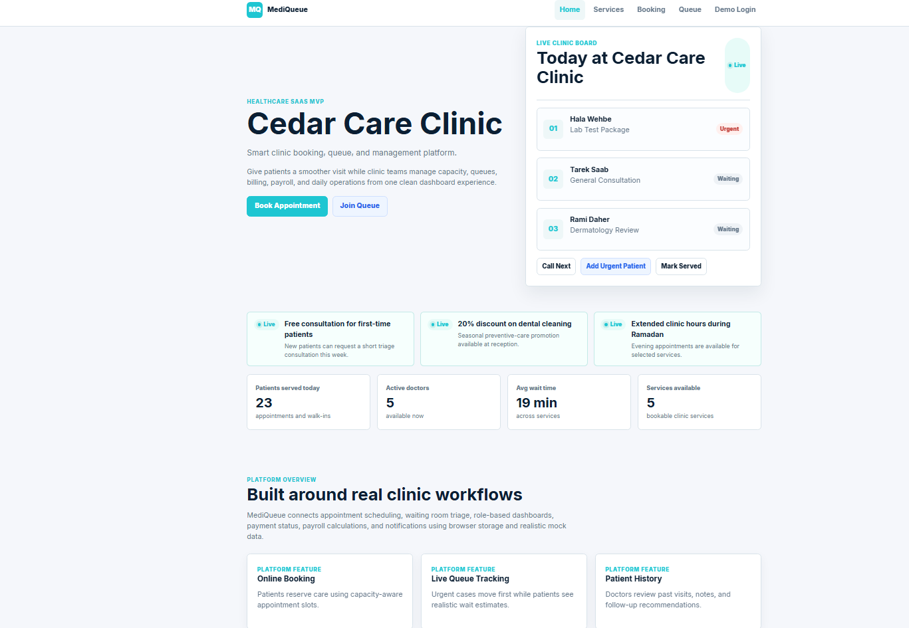
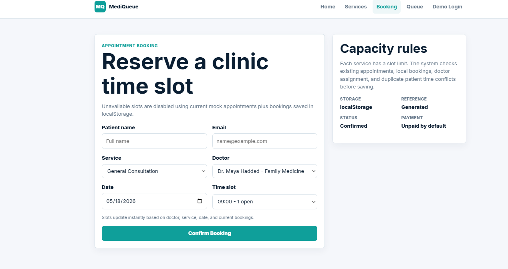
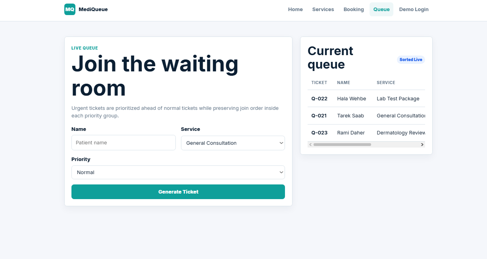
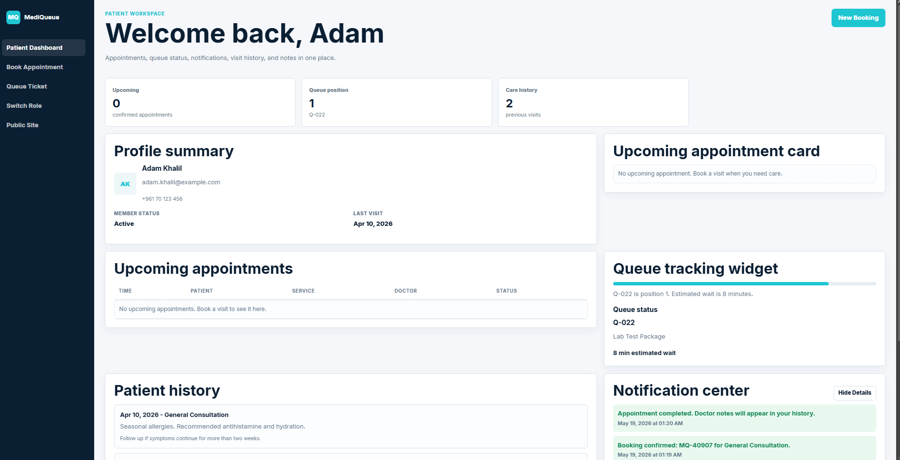
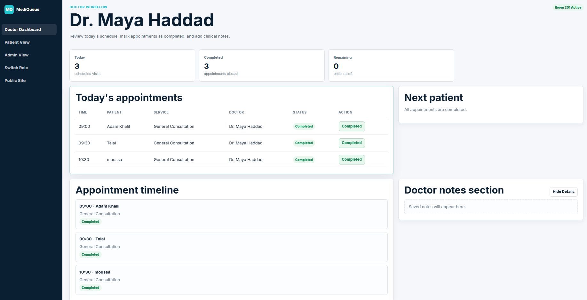
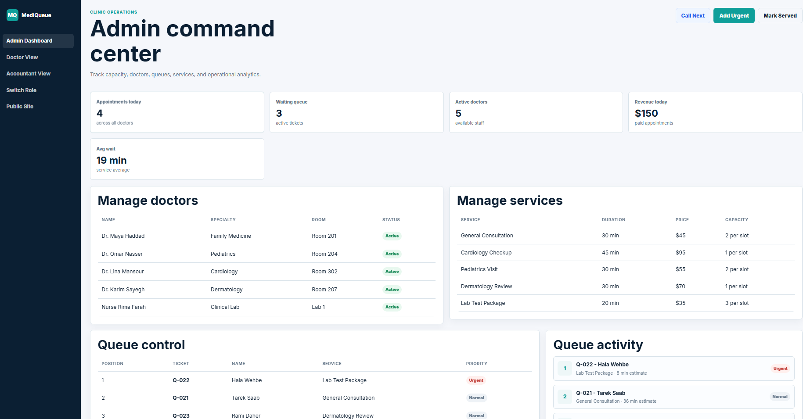
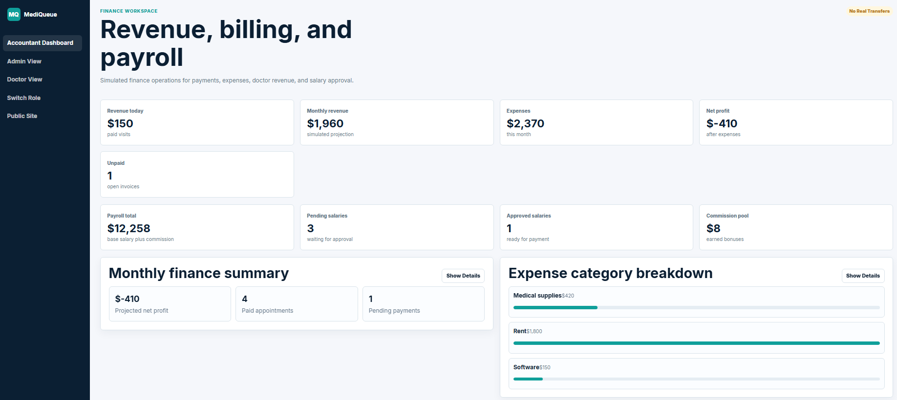

# MediQueue

MediQueue is a frontend-only MVP for a smart clinic booking, queue, and management platform. It is built as a realistic healthcare SaaS interface for a Computer Science portfolio project, using only HTML, CSS, JavaScript, mock data, and localStorage.

## Live Demo

[Open MediQueue](https://adam-alzayat.github.io/MediQueue-Clinic-Management-System/)

## Features

- Online appointment booking with capacity-aware scheduling
- Slot availability checks by service, doctor, date, and time
- Local double-booking prevention for the same patient time slot
- Live queue joining with ticket generation
- Urgent patient priority sorting and estimated wait times
- Role-based demo dashboards for patients, doctors, admins, and accountants
- Patient history with previous visits, doctor notes, and follow-up recommendations
- Doctor workflow for viewing appointments, saving notes, and marking visits completed
- Admin analytics for appointments, queues, active doctors, revenue, wait time, and capacity
- Accountant dashboard with billing status, revenue reports, expenses, and simulated payroll approvals
- Notification simulation inside the UI
- Responsive SaaS-style layouts with cards, tables, and dashboard sidebars
- Interactive homepage queue preview with call-next, urgent patient, and served actions
- Admin platform customization for clinic name, hero tagline, accent color, homepage features, and promotional banners
- System activity log, revenue trend previews, queue activity, and richer role dashboards

## Technologies Used

- HTML
- CSS
- JavaScript
- localStorage
- Static mock data

No React, backend, database, API, or frontend framework is used.

## Dashboard Roles

### Patient Dashboard
- Upcoming appointments
- Queue status tracking
- Notifications and alerts
- Visit history
- Doctor notes and follow-up recommendations

### Doctor Dashboard
- Today's appointments
- Appointment completion workflow
- Patient history preview
- Clinical notes section
- Appointment timeline

### Admin Dashboard
- Clinic overview and analytics
- Queue management
- Capacity settings
- Doctor and service management
- Revenue previews and activity logs

### Admin Customization
- Homepage feature management
- Promotional banners
- Accent color customization
- Clinic name and hero tagline customization

### Accountant Dashboard
- Revenue overview
- Billing and payment status
- Service and doctor revenue reports
- Expense management
- Payroll approval simulation
- Monthly finance summaries

## System Architecture Overview

- `assets/js/data.js` contains mock data for doctors, patients, services, appointments, queue entries, notifications, expenses, payroll, and booking slots.
- `assets/js/app.js` contains shared frontend logic for rendering dashboards, calculating analytics, checking booking capacity, sorting queue entries, handling notifications, and saving localStorage state.
- `assets/css/style.css` contains the responsive design system shared across all public pages and dashboards.
- HTML pages act as static view layers connected through shared frontend scripts and browser storage.

## localStorage Usage

The application stores simulated data locally for:

- Bookings
- Queue entries
- Doctor notes
- Completed appointments
- Notifications
- Expenses
- Payroll status
- Platform customization settings
- Queue preview state
- Activity logs

## File Structure

```text
MediQueue/
│
├── index.html
├── services.html
├── booking.html
├── queue.html
├── login.html
│
├── dashboards/
│   ├── dashboard-patient.html
│   ├── dashboard-doctor.html
│   ├── dashboard-admin.html
│   └── dashboard-accountant.html
│
├── assets/
│   ├── css/
│   │   └── style.css
│   │
│   ├── js/
│   │   ├── app.js
│   │   └── data.js
│   │
│   └── images/
│
├── README.md
└── .gitignore
```

## Future Improvements

- Add real authentication and user sessions
- Connect to a backend API and database
- Add doctor/admin calendar scheduling
- Add invoice export and printable receipts
- Add patient search and filtering
- Add role permissions and audit logs
- Add automated frontend tests

## Screenshots

### Homepage


### Booking Page


### Queue System


### Patient Dashboard


### Doctor Dashboard


### Admin Dashboard


### Accountant Dashboard

